# What is Cholo?

Cholo is a taxicab application that let you choose ride, add your vehicle to provide ride, and add yourself also as a driver from anywhere in the world.


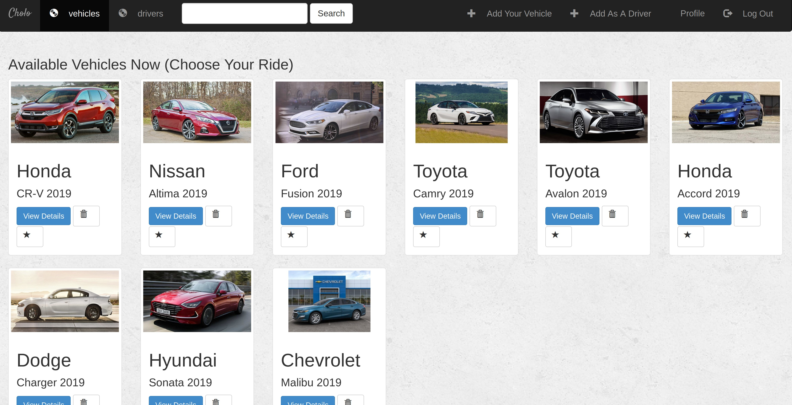

# How does it work?

To get started, first create a account through signup page if you are not already an user. Provide valid information in your profile.


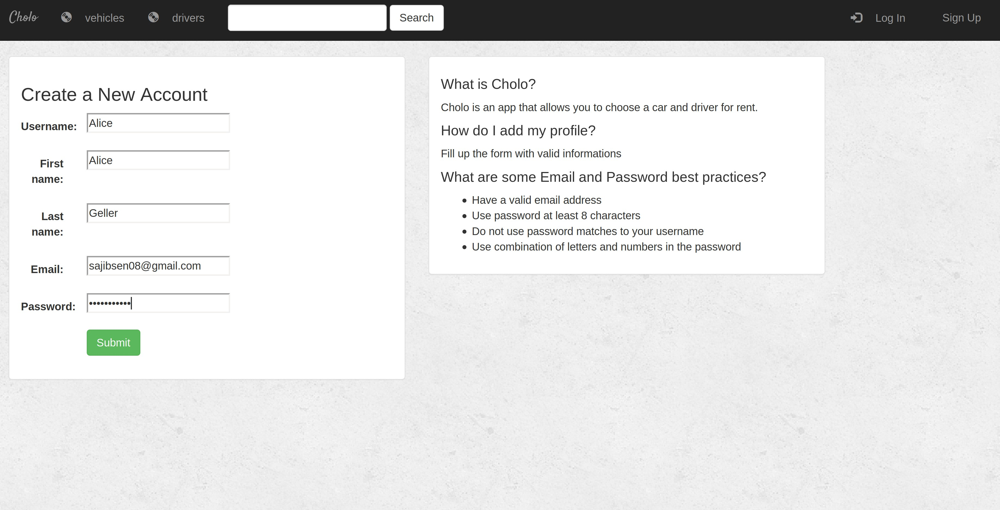

After you create a profile you will be redirected to the homepage showed previously

# Details of Every Vehicle

Before you choose a ride you can see details of every vehicles one by one including all drivers available/associated with the vehicle to give you a ride


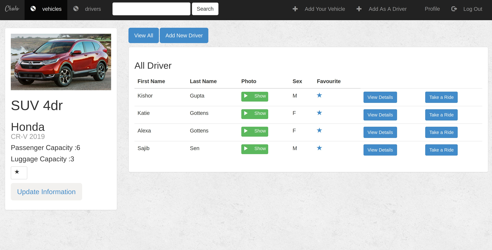

# Details of Every Driver for Each Vehicle

You can click on the View Details options to see the details of each driver associated with the vehicle


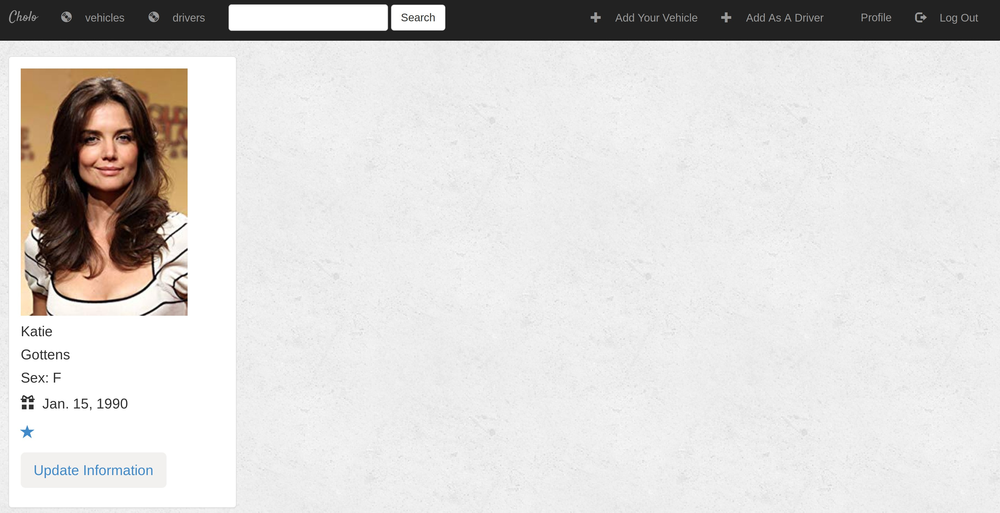

# Add/Update a vehicle

You can add a vehicle available to provide service to the application and also update the information of the vehilce when needed


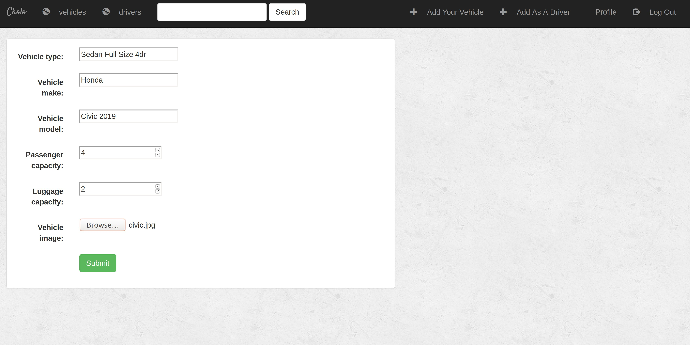

# Add/Update a driver

If you add yourself as a driver, then you can also update the information when needed


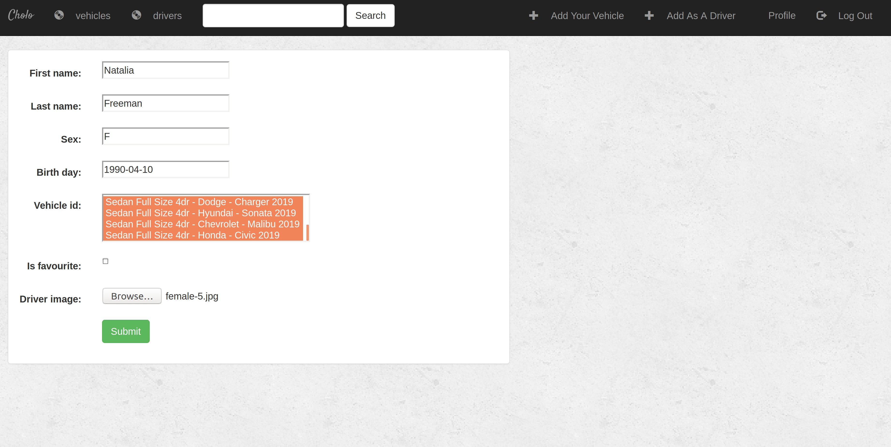

# Search with Keyword (e.g. Toyota, Camry, M, etc.)

Search anything using keyword in the search block

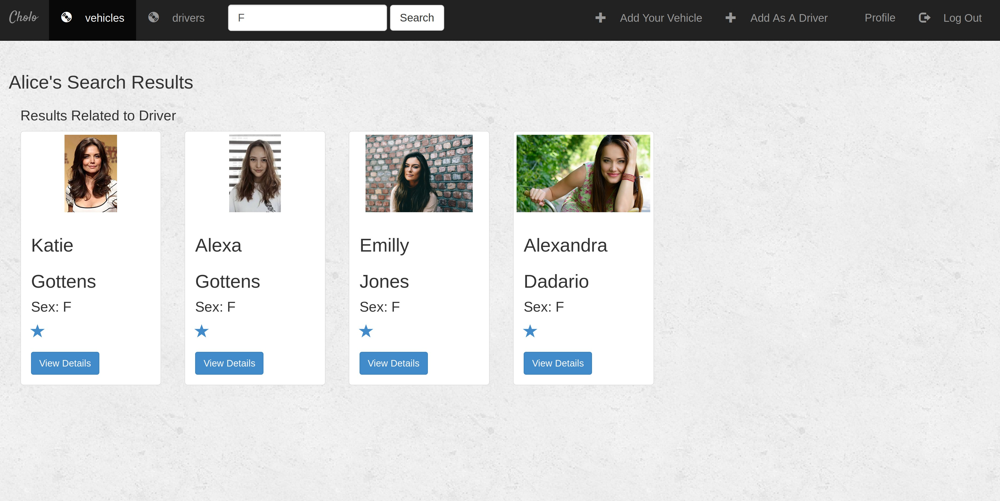

# Create and Complete a Ride

A form to ask for a ride and complete that ride

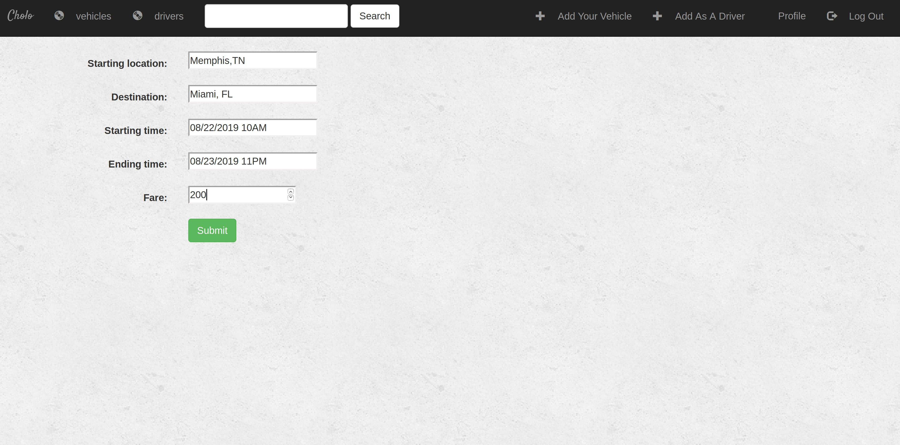

# Every Ride Details

After completing the ride information form, the user will be redirected to a page where more detailed information of the ride will be delivered, including vehicle information, driver information, and ride information


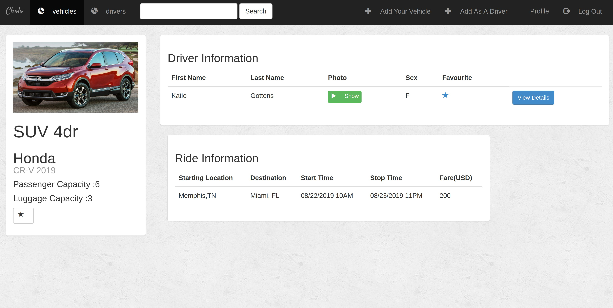

# Profile page

Current User profile information

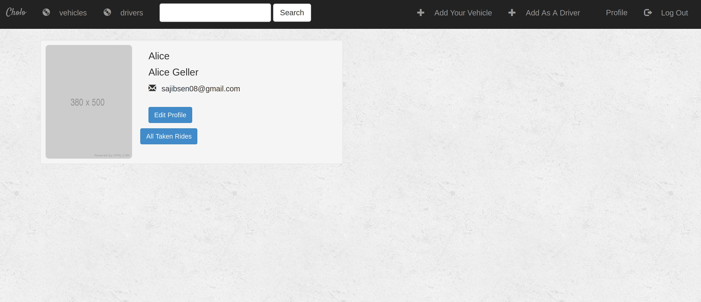

# Edit User Profile

User can edit their information by clicking Edit Profile button

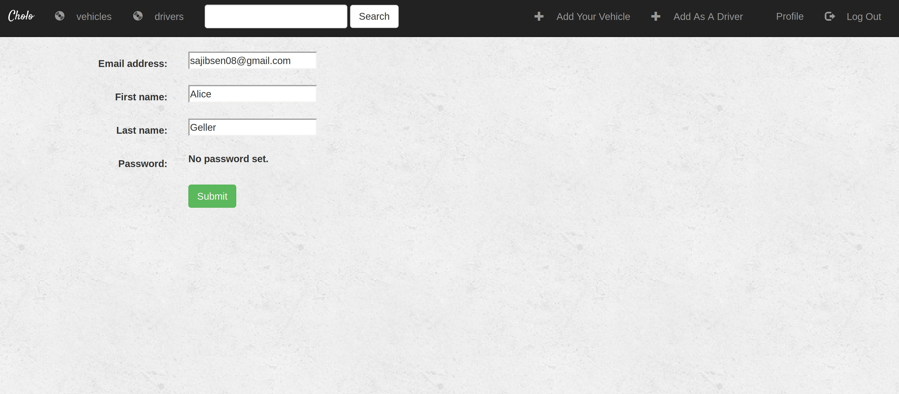

# All rides taken by the current User

A user can also see how many rides he/she has taken untill now by clicking "All Taken Rides" option in the "Profile" page 


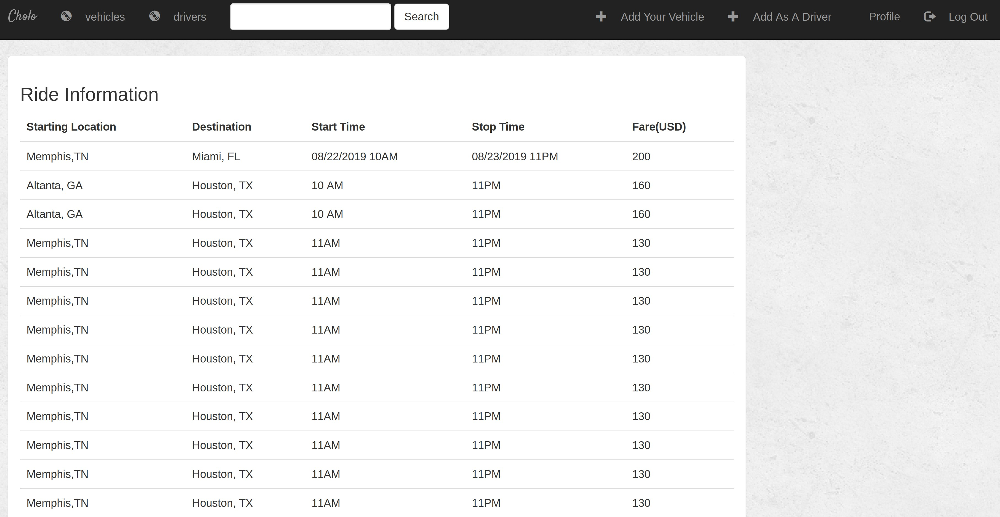

# Login page

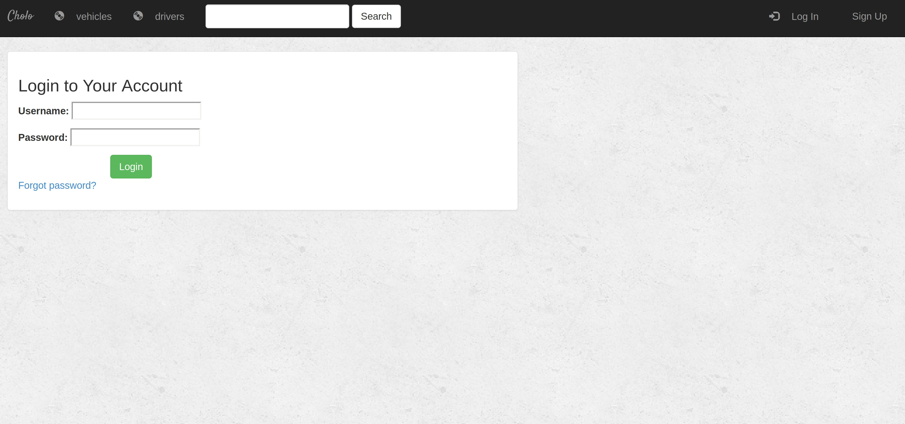

# Password reset

If a user forgot his/her password, they can reset a new password by clicking "Forgot password" option. Here I used the default html template provided by django admimistration. You can use on your own if you want to deploy as a professional


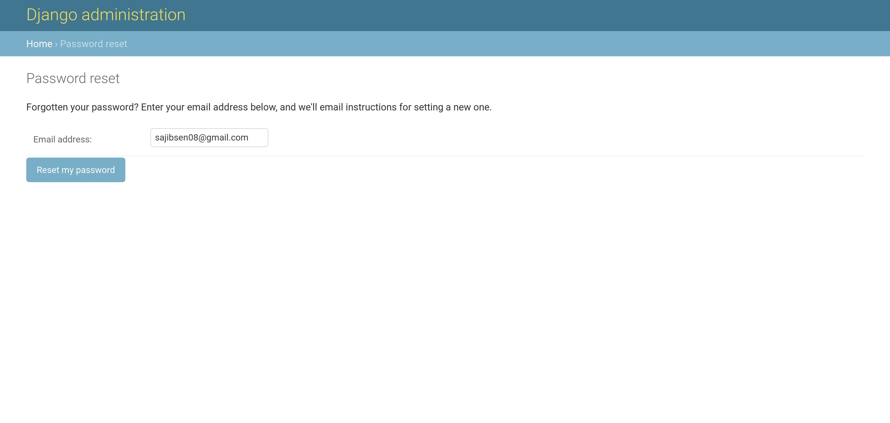

# Password reset link sent to email

The below image shows how password is sent to provided email. Here I use smtp port 1025 to see when the locahost server connecting any webmail server. So user can see what email from the django server has been provided to the email as well as also copy the link to reset the password


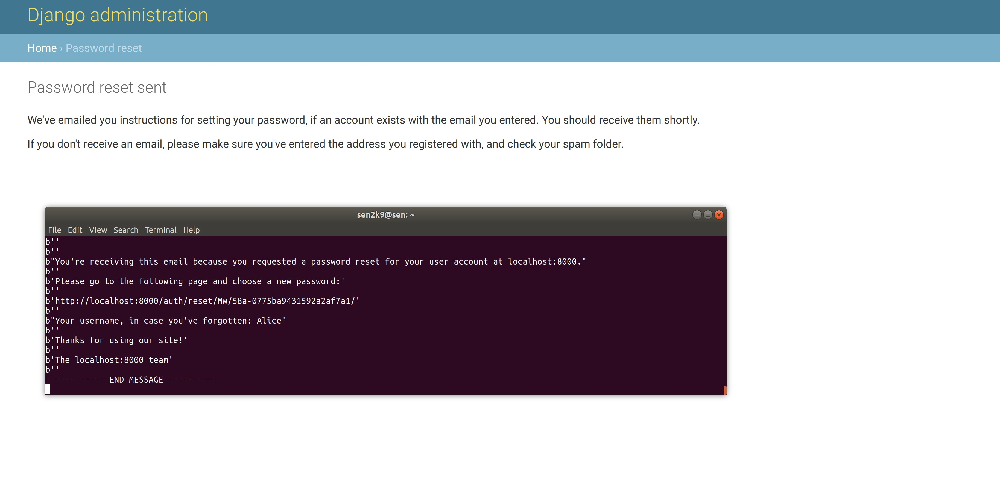

# Setting new password/Reset Password through email link

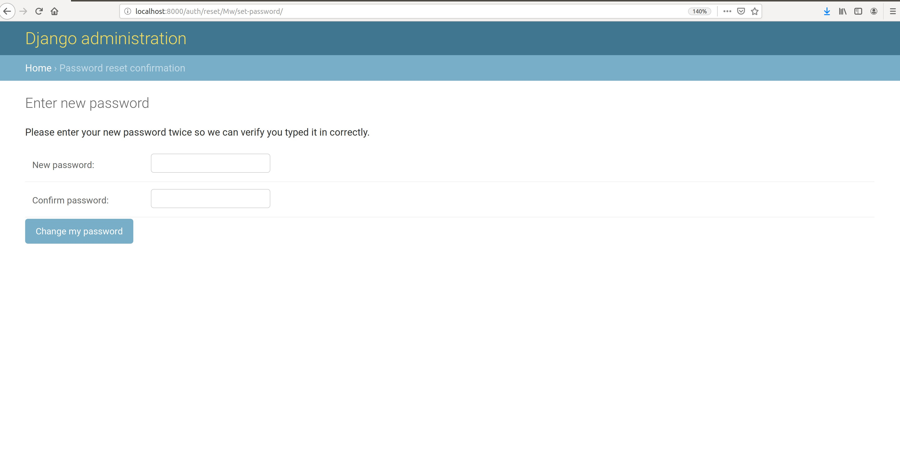

# Password Reset Complete

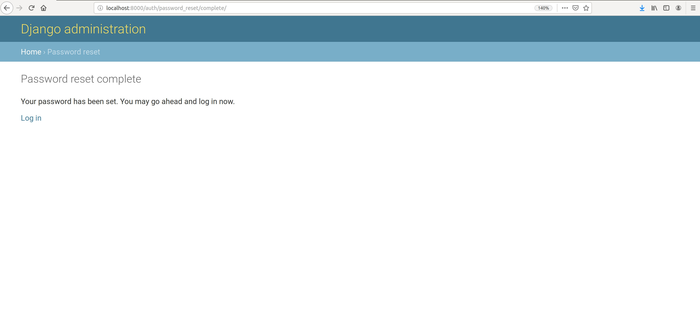


```python

```
